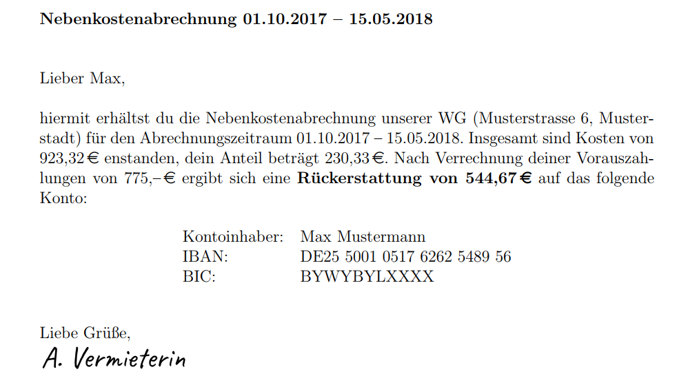

FlatShare
=======

FlatShare is a small Windows-only tool that supports German landlords and main tenants of shared flats in accounting and issuing of service charge bills. Use it to
- get warned about missing payments and/or refunds,
- generate tax reports for your yearly tax declaration ([Example](/samples/2018_tax_report.pdf)),
- generate service charge bills as ready-to-send pdf files ([Example 1](/samples/bill_Emilia_Musterfrau.pdf), [Example 2](/samples/bill_Max_Mustermann.pdf)).

Why to use
------------

In contrast to existing solutions such as proprietary rental software or handcrafted excel sheets it

- is specialized to flat sharing,
- supports arbitrary number and changes of tenants,
- handles frequent changes of allocation keys when people move in or out,
- supports day-exact service charges for electricity, gas, water, etc. based on meter readings,
- incorporates some specialities of the German law such as the [Kohlendioxidkostenaufteilungsgesetz - CO2KostAufG](https://www.gesetze-im-internet.de/co2kostaufg/BJNR215400022.html),
- automatically and robustly maps account transactions to claims, warning about missing transactions.

When not to use
------------

This project is maintained and extended according to my personal needs. Do not rely on it if you

- require tax declarations and service charge bills to be legally incontestable (check out §15 and §16 of the [GNU AGPLv3 license](LICENSE)),
- want a fancy graphical user interface (usage is via terminal & editing of xml files),
- require reliable external maintenance and support from me.
- expect proper documentation for users.

There is no documentation for users in place, so you need to work your way up from one sample configuration I provide, as well as the source code itself. Generated bills and tax reports are not guaranted to respect all current and/or future legal requirements according to the German law. Even though I try to follow legal requirements as best as I can, my primary goal is providing an as-fair-as-possible distribution of service charges, not necessarily an incontestable bill. I am having a great time with my flatmates, and I believe that we can settle all disagreements out of court.

How to build
------------

The project is set up as a Visual Studio Net project. It requires

- a recent version of Visual Studio (tested with VS2022),
- the `Net desktop development` workload and `NuGet package manager` component from the Visual Studio installer,
- a working TeX distribution with `pdflatex.exe` in your path (tested with MikTex 25.4)

After setting up your environment, build the `FlatShare` project in Visual Studio. It will generate build artifacts in `<solutiondir>/FlatShare/build/`. Make sure to run the unit test provided in the `FlatShareTests` project. Some tests may fail if the tex distribution is not setup correctly.

Some of the TeX template resources still need to be adapted to your use-case, as they contain some hardcoded personal information that is not stored in the database yet. Search the project for `% TODO` and update the TeX templates to your liking.

You can also deploy the project with Visual Studio's Publish Wizard. It outputs an installer in `<solutiondir>/deploy/` which you can use to install or update FlatShare on your machine. Please make sure to check and understand the project's license as well as those of utilized NuGet packages before distributing your build.

How to use
------------

After launching `FlatShare` for the first time:

- Pick an empty directory where all your database and generated pdfs will be stored.
- Initialize it with the sample scenario.
- Choose a password to encrypt your databse. **Do not loose it!** If you do, your database is gone forever.
- You are going to see some warning about uncovered liabilities and unassigned prepayments. This is intentional. The accounting module of the program checks if all rents up to the _current date_ have been payed, and if service charge prepayments are covered by a bill eventually. Since the sample scenario only contains transactions that are well in the past (ranging from 2017 to 2019), a lot of rent payments as well as issued bills are missing.
- Generate a sample tax report by typing `taxes 2018`. Your tex distribution might ask you to install some required packages. Accept those.
- Generate a sample bill by typing `bill 2017 2018 mustermann` or `bill 08-2018 07-2019 musterfrau`. Again, agree on your tex distribution to install packages if necessary.
- Type `help` and accustom yourself with available commands.
- Type `storage maintain` and inspect the xml-files representing your database. Adapt them and apply the changes. Check how they affect generated reports. Also, consider checking the source code to see what impact various features have.
- Update the database to reflect your shared flat.
- Import transaction lists of your bank account with `import`. Right now the import tool only supports csv files generated by the export tool of the Deutsche Kreditbank Berlin.
- Type `settle check` to verify that all transactions are in place as expected.

License
-------

This project is licensed under the [GNU Affero General Public License, Version 3](LICENSE). Dependencies such as NuGet packages may be licensed differently.

Contact
-------

If you are interested in this project and plan to use it, feel free to contact me at flatshare[at]creinbold[dot]de.
